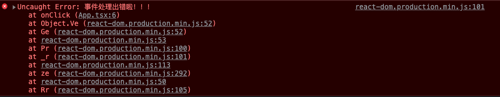
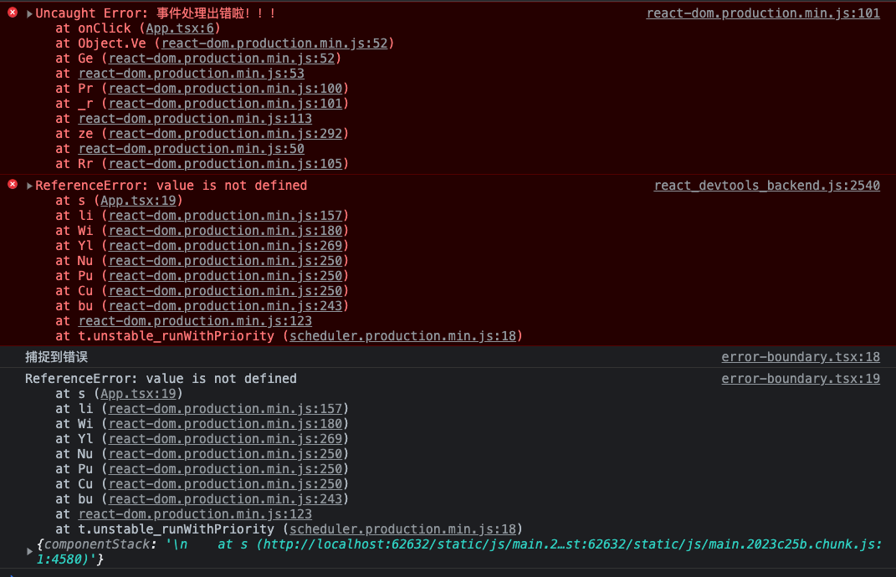

## 链接

- [React 官方文档 - Error Boundaries](https://reactjs.org/docs/error-boundaries.html)
- [第三方库：react-error-boundary](https://github.com/bvaughn/react-error-boundary)

## 处理哪些错误

- 简单来说，ErrorBoundary 是来处理 JS 代码出现问题的，就像后端代码出错后（比如访问了不存在的属性）会返回 500 一样，前端代码出错了，也应该给用户一个提示（[Error boundaries are React components that **catch JavaScript errors anywhere in their child component tree, log those errors, and display a fallback UI** instead of the component tree that crashed.](https://reactjs.org/docs/error-boundaries.html?#introducing-error-boundaries)）。
- 不过，事件处理函数和用户自己调用的异步函数（比如 `setTimeout()`） 是不会处理的。其实也能大概明白，这些地方出问题很难破坏整个 Dom 树，而且很多时候需要用户自己处理这些问题（[Error boundaries do **not** catch errors for: Event handlers, Asynchronous code (e.g. `setTimeout` or `requestAnimationFrame` callbacks)](https://reactjs.org/docs/error-boundaries.html?#introducing-error-boundaries)）。

## 创建错误处理的组件

- 当错误发生后，React 会调用 `getDerivedStateFromError()` 来更新 state（[Use `static getDerivedStateFromError()` to render a fallback UI after an error has been thrown.](https://reactjs.org/docs/error-boundaries.html?#introducing-error-boundaries)）。
- 在 `componentDidCatch()` 中，存储错误信息、发送错误信息（比如发邮件之类）（[Use `componentDidCatch()` to log error information.](https://reactjs.org/docs/error-boundaries.html?#introducing-error-boundaries)）。

```tsx
type TypeError = Error | null;

export class ErrorBoundary extends Component<
  { children: ReactNode },
  { error: TypeError }
> {
  state: { error: TypeError } = { error: null };

  static getDerivedStateFromError(error: Error) {
    return { error };
  }

  componentDidCatch(error: Error, errorInfo: ErrorInfo) {
    // TODO 需要更真实的存储线上错误信息的方式
    console.log("捕捉到错误");
    console.log(error, errorInfo);
  }

  render() {
    const { error } = this.state;
    const { children } = this.props;
    return error ? <h2>JS 代码出错啦！！！！</h2> : children;
  }
}
```

## 使用组件

- 在 `<ErrorBoundary>` 中的组件的错误会被捕捉到（[Note that **error boundaries only catch errors in the components below them in the tree**.](https://reactjs.org/docs/error-boundaries.html?#introducing-error-boundaries)）。

```tsx
<ErrorBoundary>
  <App />
</ErrorBoundary>
```

## 简单的测试

### 代码

- 注意要 `build` 之后再去测试，开发模式会提供更多的错误提示。

```tsx
const App = () => {
  const [isEventError, setIsEventError] = useState(true);
  const handleThrowErrorClick = () => {
    throw new Error("事件处理出错啦！！！");
  };
  const handleSwitchClick = () =>
    setIsEventError((prevIsEventError) => !prevIsEventError);
  return (
    <>
      <button onClick={handleSwitchClick}>
        切换到{isEventError ? "渲染错误" : "事件错误"}
      </button>
      {isEventError ? (
        <button onClick={handleThrowErrorClick}>触发事件错误</button>
      ) : (
        // @ts-ignore 这里是特意弄的渲染错误，所以要把 TS 检查屏蔽掉，要不然编译过不了
        value
      )}
    </>
  );
};
```

### 结果

- 点击 “触发事件错误” 后，未捕捉到错误。



- 点击 “切换到渲染错误” 后，捕捉到错误。

